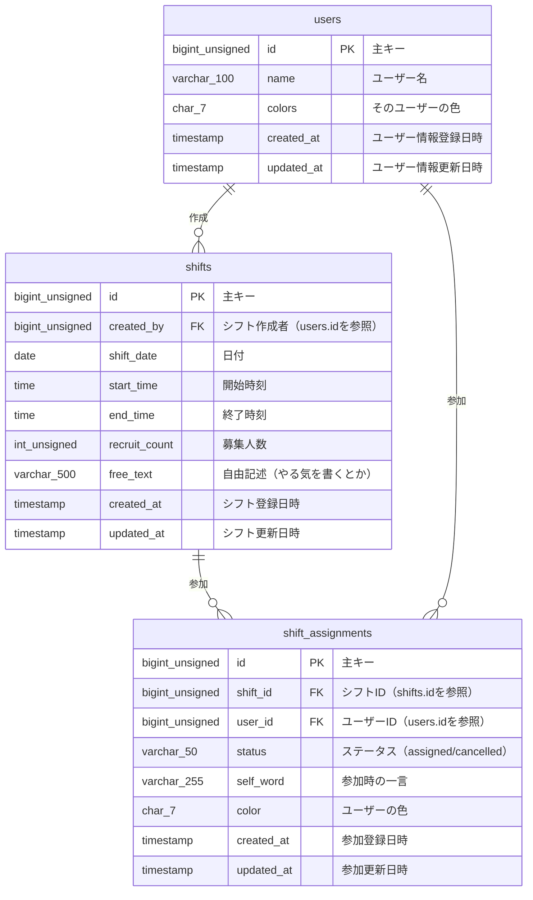

# シフトボードシステム

FuelPHPベースのシフト管理システムです。

## 概要

このシステムは、シフトの作成・管理・参加を効率的に行うためのWebアプリケーションです。

## 技術スタック

- **バックエンド**: FuelPHP 1.9
- **データベース**: MySQL 8.0
- **フロントエンド**: HTML5, CSS3, JavaScript (jQuery, Knockout.js)
- **開発環境**: Docker, Docker Compose

## データベース設計

### ERD図



### テーブル詳細

#### users テーブル
| カラム名 | データ型 | NULL許可 | デフォルト値 | 説明 |
|---------|---------|---------|-------------|------|
| id | bigint unsigned | NO | AUTO_INCREMENT | 主キー |
| name | varchar(100) | NO | - | ユーザー名 |
| colors | char(7) | YES | NULL | そのユーザーの色 |
| created_at | timestamp | NO | CURRENT_TIMESTAMP | ユーザー情報登録日時 |
| updated_at | timestamp | YES | NULL | ユーザー情報更新日時 |

#### shifts テーブル
| カラム名 | データ型 | NULL許可 | デフォルト値 | 説明 |
|---------|---------|---------|-------------|------|
| id | bigint unsigned | NO | AUTO_INCREMENT | 主キー |
| created_by | bigint unsigned | NO | - | シフト作成者（users.idを参照） |
| shift_date | date | NO | - | 日付 |
| start_time | time | NO | - | 開始時刻 |
| end_time | time | NO | - | 終了時刻 |
| recruit_count | int unsigned | NO | 1 | 募集人数 |
| free_text | varchar(500) | YES | NULL | 自由記述（やる気を書くとか） |
| created_at | timestamp | NO | CURRENT_TIMESTAMP | シフト登録日時 |
| updated_at | timestamp | YES | NULL | シフト更新日時 |

#### shift_assignments テーブル
| カラム名 | データ型 | NULL許可 | デフォルト値 | 説明 |
|---------|---------|---------|-------------|------|
| id | bigint unsigned | NO | AUTO_INCREMENT | 主キー |
| shift_id | bigint unsigned | NO | - | シフトID（shifts.idを参照） |
| user_id | bigint unsigned | NO | - | ユーザーID（users.idを参照） |
| status | varchar(50) | NO | assigned | ステータス（assigned/cancelled） |
| self_word | varchar(255) | YES | NULL | 参加時の一言 |
| color | char(7) | YES | NULL | ユーザーの色 |
| created_at | timestamp | NO | CURRENT_TIMESTAMP | 参加登録日時 |
| updated_at | timestamp | YES | NULL | 参加更新日時 |

## セットアップ

### 前提条件
- Docker
- Docker Compose

### 起動方法
```bash
# コンテナを起動
docker-compose up -d

# データベースの初期化
docker-compose exec db mysql -u app -papp_pass shiftboard < fuel/app/data/schema.sql
```

### アクセス
- アプリケーション: http://localhost:8081
- phpMyAdmin: http://localhost:8082

## 機能

- シフトの作成・編集・削除
- シフトの一覧表示（月・週・日表示）
- シフトへの参加・キャンセル
- ユーザー管理
- レスポンシブデザイン対応

## 開発状況

現在、基本的なシフト管理機能は実装済みです。詳細な実装状況については、プロジェクト内の各ファイルを参照してください。

構成イメージ
fuel/
 ├ app/
 │   ├ classes/
 │   │   ├ controller/
 │   │   │   ├ shifts.php      ← シフト管理用Controller
 │   │   │   ├ users.php       ← ユーザー管理用Controller
 │   │   │   └ myshifts.php    ← 自分のシフトController
 │   │   └ model/
 │   │       ├ shift.php       ← Shiftモデル
 │   │       └ user.php        ← Userモデル
 │   └ views/
 │       ├ shifts/
 │       │   ├ index.php       ← シフト一覧
 │       │   ├ create.php      ← シフト登録フォーム
 │       │   ├ view.php        ← シフト詳細
 │       ├ users/
 │       │   ├ index.php       ← ユーザー一覧
 │       │   └ create.php      ← ユーザー登録
 │       └ myshifts/
 │           └ index.php       ← 自分のシフト