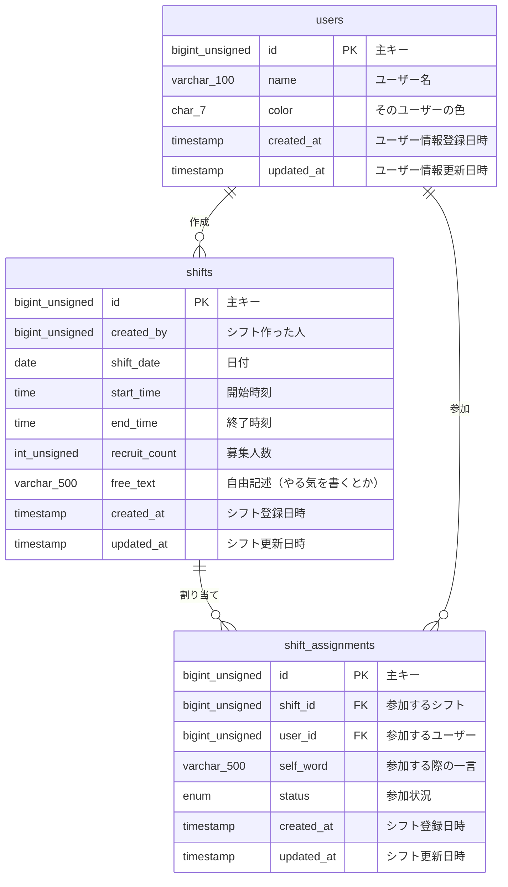

# シフトボードシステム

FuelPHPベースのシフト管理システムです。

## 概要

このシステムは、シフトの作成・管理・参加を効率的に行うためのWebアプリケーションです。中間テーブルを使用した1:n構造で、柔軟なシフト管理を実現しています。

## 技術スタック

- **バックエンド**: FuelPHP 1.9
- **データベース**: MySQL 8.0
- **フロントエンド**: HTML5, CSS3, JavaScript (jQuery, Knockout.js)
- **開発環境**: Docker, Docker Compose

## データベース設計

### ERD図



### 1:n構造

- **shifts : shift_assignments** - 1つのシフトに対して複数の割り当て
- **users : shift_assignments** - 1人のユーザーが複数のシフトに参加

### テーブル詳細

#### users テーブル
| カラム名 | データ型 | NULL許可 | デフォルト値 | 説明 |
|---------|---------|---------|-------------|------|
| id | bigint unsigned | NO | AUTO_INCREMENT | 主キー |
| name | varchar(100) | NO | - | ユーザー名 |
| color | char(7) | YES | NULL | そのユーザーの色 |
| created_at | timestamp | NO | CURRENT_TIMESTAMP | ユーザー情報登録日時 |
| updated_at | timestamp | YES | NULL | ユーザー情報更新日時 |

#### shifts テーブル
| カラム名 | データ型 | NULL許可 | デフォルト値 | 説明 |
|---------|---------|---------|-------------|------|
| id | bigint unsigned | NO | AUTO_INCREMENT | 主キー |
| created_by | bigint unsigned | NO | - | シフト作った人 |
| shift_date | date | NO | - | 日付 |
| start_time | time | NO | - | 開始時刻 |
| end_time | time | NO | - | 終了時刻 |
| recruit_count | int unsigned | NO | 1 | 募集人数 |
| free_text | varchar(500) | YES | NULL | 自由記述（やる気を書くとか） |
| created_at | timestamp | NO | CURRENT_TIMESTAMP | シフト登録日時 |
| updated_at | timestamp | YES | NULL | シフト更新日時 |

#### shift_assignments テーブル
| カラム名 | データ型 | NULL許可 | デフォルト値 | 説明 |
|---------|---------|---------|-------------|------|
| id | bigint unsigned | NO | AUTO_INCREMENT | 主キー |
| shift_id | bigint unsigned | NO | - | 参加するシフト(shifts.idを参照) |
| user_id | bigint unsigned | NO | - | 参加するユーザー(users.idを参照) |
| self_word | varchar(500) | YES | - | 参加する際の一言 |
| status | enum('assigned','confirmed','cancelled') | NO | assigned | 参加状況 |
| created_at | timestamp | NO | CURRENT_TIMESTAMP | シフト登録日時 |
| updated_at | timestamp | YES | NULL | シフト更新日時 |

## セットアップ

### 前提条件
- Docker
- Docker Compose

### 起動方法
```bash
# コンテナを起動
docker-compose up -d

# データベースの初期化
docker-compose exec db mysql -u app -papp_pass shiftboard < fuel/app/data/schema.sql
```

### アクセス
- アプリケーション: http://localhost:8081
- phpMyAdmin: http://localhost:8082

## 機能

### シフト管理
- シフトの作成・編集・削除
- シフトの一覧表示（カレンダー・リスト表示）
- 募集人数の管理
- 自由記述欄での詳細情報

### 参加管理
- シフトへの参加・キャンセル
- 参加状況の管理（assigned/confirmed/cancelled）
- 参加時の一言メッセージ
- 定員管理

### ユーザー管理
- ユーザーの作成・編集・削除
- ユーザー別の色設定
- 権限管理（member/admin）

### API機能
- RESTful API設計
- JSON形式でのデータ交換
- エラーハンドリング

## API エンドポイント

### シフト管理
- `GET /api/shifts` - シフト一覧取得
- `POST /api/shifts` - シフト作成
- `GET /api/shifts/{id}` - シフト詳細取得
- `PUT /api/shifts/{id}` - シフト更新
- `DELETE /api/shifts/{id}` - シフト削除

### シフト参加
- `POST /api/shifts/{id}/join` - シフト参加
- `POST /api/shifts/{id}/cancel` - シフト参加取消

### ユーザー管理
- `GET /api/users` - ユーザー一覧取得
- `POST /api/users` - ユーザー作成
- `GET /api/users/{id}` - ユーザー詳細取得
- `PUT /api/users/{id}` - ユーザー更新
- `DELETE /api/users/{id}` - ユーザー削除

### 割り当て管理
- `GET /api/shift_assignments` - 割り当て一覧取得
- `POST /api/shift_assignments` - 割り当て作成
- `PUT /api/shift_assignments/{id}` - 割り当て更新
- `DELETE /api/shift_assignments/{id}` - 割り当て削除

## 開発状況

- ✅ 基本的なシフト管理機能
- ✅ ユーザー管理機能
- ✅ シフト参加・キャンセル機能
- ✅ RESTful API実装
- ✅ 中間テーブルを使用した1:n構造
- ✅ レスポンシブデザイン対応

## 今後の予定

- 認証機能の実装
- 通知機能の追加
- 統計・レポート機能
- バッチ処理の実装
